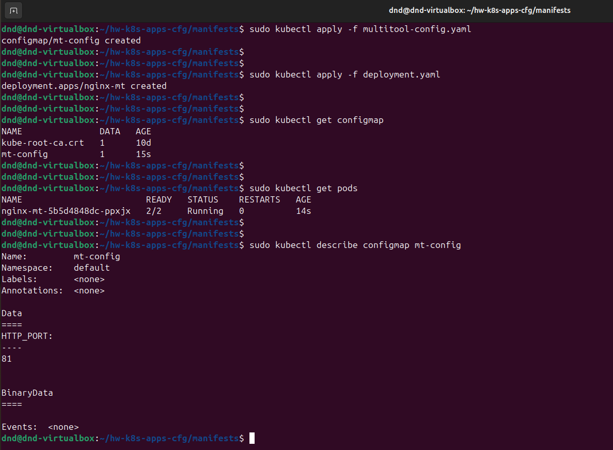
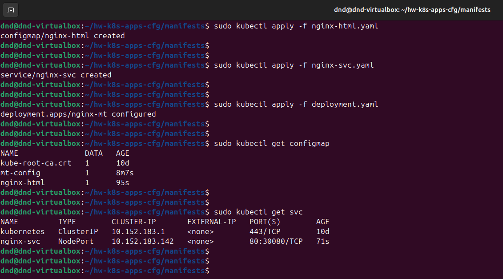
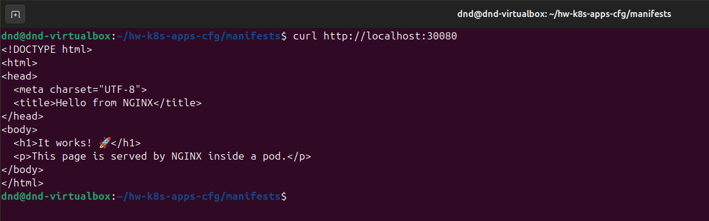
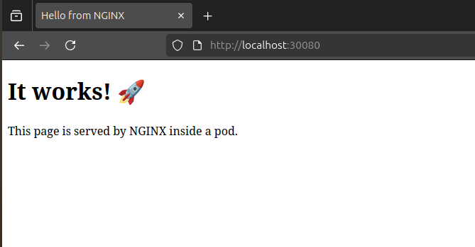

# Домашнее задание к занятию "`Конфигурация приложений`" - `Дедюрин Денис`

---
## Задание 1. Создать Deployment приложения и решить возникшую проблему с помощью ConfigMap. Добавить веб-страницу

1. Создать **Deployment** приложения, состоящего из контейнеров **nginx** и **multitool**.
2. Решить возникшую проблему с помощью **ConfigMap**.
3. Продемонстрировать, что **pod** стартовал и оба конейнера работают.
4. Сделать простую веб-страницу и подключить её к **Nginx** с помощью **ConfigMap**. Подключить **Service** и показать вывод **curl** или в браузере.
5. Предоставить манифесты, а также скриншоты или вывод необходимых команд.

### Ответ:

1. Создаем **Deployment** и **ConfigMap**:

**deployment.yaml**

```
apiVersion: apps/v1
kind: Deployment
metadata:
  name: nginx-mt
spec:
  replicas: 1
  selector:
    matchLabels:
      app: nginx-mt
  template:
    metadata:
      labels:
        app: nginx-mt
    spec:
      containers:
        - name: nginx
          image: nginx:1.25.3
          ports:
            - containerPort: 80
        - name: multitool
          image: wbitt/network-multitool
          ports:
            - containerPort: 81
          env:
            - name: HTTP_PORT
              valueFrom:
                configMapKeyRef:
                  name: mt-config
                  key: HTTP_PORT

```

**multitool-config.yaml**

```
apiVersion: v1
kind: ConfigMap
metadata:
  name: mt-config
data:
  HTTP_PORT: "81"
```

Применяем и проверяем, что все корректно запустилось:

```
sudo kubectl apply -f multitool-config.yaml
```

```
sudo kubectl apply -f deployment.yaml
```

```
sudo kubectl get configmap
```

```
sudo kubectl get pods
```

```
sudo kubectl describe configmap multitool-config
```



2. Создаем пустую веб-страницу и подключаем её к **Nginx** с помощью **ConfigMap**:

**nginx-html.yaml**

```
apiVersion: v1
kind: ConfigMap
metadata:
  name: nginx-html
data:
  index.html: |
    <!DOCTYPE html>
    <html>
    <head>
      <meta charset="UTF-8">
      <title>Hello from NGINX</title>
    </head>
    <body>
      <h1>It works! 🚀</h1>
      <p>This page is served by NGINX inside a pod.</p>
    </body>
    </html>
```
**nginx-svc.yaml**

```
apiVersion: v1
kind: Service
metadata:
  name: nginx-svc
spec:
  selector:
    app: nginx-mt
  type: NodePort
  ports:
    - protocol: TCP
      port: 80
      targetPort: 80
      nodePort: 30080
```

Обновим **Deployment** чтобы смонтировать **HTML** из **ConfigMap**:

```
apiVersion: apps/v1
kind: Deployment
metadata:
  name: nginx-mt
spec:
  replicas: 1
  selector:
    matchLabels:
      app: nginx-mt
  template:
    metadata:
      labels:
        app: nginx-mt
    spec:
      containers:
        - name: nginx
          image: nginx:1.25.3
          ports:
            - containerPort: 80
          volumeMounts:
            - name: html-volume
              mountPath: /usr/share/nginx/html
        - name: multitool
          image: wbitt/network-multitool
          env:
            - name: HTTP_PORT
              valueFrom:
                configMapKeyRef:
                  name: mt-config
                  key: HTTP_PORT
          ports:
            - containerPort: 81
      volumes:
        - name: html-volume
          configMap:
            name: nginx-html
```

Применяем внесенные изменения:

```
sudo kubectl apply -f nginx-html.yaml
```

```
sudo kubectl apply -f nginx-svc.yaml
```

```
sudo kubectl apply -f deployment.yaml
```

```
sudo kubectl get configmap
```

```
sudo kubectl get svc
```



Проверяем доступность страницы с помощью curl и браузера:





---
## Задание 2. Создать приложение с вашей веб-страницей, доступной по HTTPS 

1. Создать Deployment приложения, состоящего из Nginx.
2. Создать собственную веб-страницу и подключить её как ConfigMap к приложению.
3. Выпустить самоподписной сертификат SSL. Создать Secret для использования сертификата.
4. Создать Ingress и необходимый Service, подключить к нему SSL в вид. Продемонстировать доступ к приложению по HTTPS. 
4. Предоставить манифесты, а также скриншоты или вывод необходимых команд.

### Ответ:
